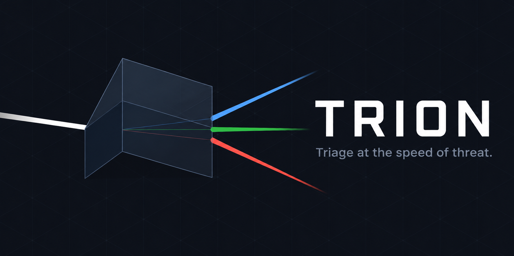

<p align="center">
  
</p>

# Trion

Self-hosted Security Operations Center platform.
Real-time alert triage, threat intelligence enrichment, and drift detection.

[SOC Dashboard →](https://trion-snowy.vercel.app) · [Docs](#documentation)

<p align="left">
  
  
  
  
  
  
  
  
</p>

---

## Two components

Trion is two independent tools that can be used together or separately. Each runs in its own Docker stack with no shared state.

| Component | Description | Port | Docs |
|-----------|-------------|------|------|
| **Trion SOC** | Next.js dashboard — Wazuh + n8n + Supabase pipeline | 3000 | [docs/](docs/) |
| **trion-agent** | Drift detection agent + local web dashboard | 8080 | [trion-agent/](trion-agent/) |

---

## Trion SOC — Quick overview

> *Triage at the speed of threat.*

Trion SOC connects Wazuh agents to a live Next.js dashboard through an automated n8n pipeline. Security events flow from Wazuh endpoints through three n8n workflows (`soc-ingest`, `soc-triage`, `soc-error-handler`) into a Supabase database, where the dashboard polls them every 30 seconds. IOCs are automatically enriched against VirusTotal, AbuseIPDB, and MalwareBazaar before being posted to Slack. A live demo is available at [trion-snowy.vercel.app](https://trion-snowy.vercel.app) — login: `demo`.

---

## trion-agent — Quick overview

> *Silent. Daily. Precise.*

trion-agent takes daily snapshots of critical system state (ports, services, users, cron, autoruns), diffs them against the previous day, and sends the delta to an LLM for classification (BENIGN / SUSPECT / CRITICAL). Only actionable findings trigger a Slack alert — BENIGN runs are completely silent.

The agent ships with a self-hosted web dashboard (`agent_ui.py`) for viewing scan history, comparing diffs, configuring the agent, and triggering manual runs — all without touching the command line.

See [trion-agent/README.md](trion-agent/README.md) for full setup instructions.

---

## Docker stacks

The two components are fully isolated. Each has its own `docker-compose` file with no shared networks or volumes.

**SOC stack** — Next.js dashboard + n8n (port 3000 + 5678):
```bash
cp .env.example .env.local   # fill in Supabase, n8n, and auth values
docker compose -f docker-compose.soc.yaml up -d --build
```

**Agent stack** — dashboard + scheduler (port 8080):
```bash
cd trion-agent
cp config.toml.example config.toml   # fill in LLM and notification values
docker compose up -d --build
```

Both stacks can run on the same host without conflict — they use different ports and separate data stores.

---

## Installation

**Prerequisites — Trion SOC**
- Node.js 18+ and npm
- Docker with Compose plugin v2
- A [Supabase](https://supabase.com) project (free tier works)

**Prerequisites — trion-agent**
- Python 3.11+
- A Slack Incoming Webhook URL
- A LLM provider: Ollama (local, free) or OpenAI / Anthropic API key

**Trion SOC**

```bash
git clone https://github.com/S2K7x/Trion
cd Trion
./install.sh
```

The interactive script handles prerequisites, environment configuration, Supabase schema setup, and service launch.

```bash
./install.sh --mode dev          # Next.js dev server + n8n in Docker
./install.sh --mode full         # Everything in Docker (uses docker-compose.soc.yaml)
./install.sh --mode full --skip-db   # Skip schema if already applied
```

**trion-agent**

```bash
cd trion-agent
./install.sh    # Linux/macOS — native install with systemd/LaunchAgent
./install.ps1   # Windows — native install with Scheduled Task
# or
docker compose up -d --build    # Docker install (dashboard + scheduler)
```

---

## Documentation

| File | Description |
|------|-------------|
| [docs/architecture.md](docs/architecture.md) | n8n workflows, data flow, key design decisions |
| [docs/deployment.md](docs/deployment.md) | Deployment modes, prerequisites, environment variables |
| [docs/threat-intel.md](docs/threat-intel.md) | Threat intel APIs, rate limits, IOC types |
| [trion-agent/README.md](trion-agent/README.md) | trion-agent full documentation |

---

## Architecture

```
Wazuh agents → n8n (soc-ingest → soc-triage) → Supabase → SOC Dashboard (port 3000)
                                              ↘ Slack

trion-agent (any host) → LLM → Slack
                       → data/ → Agent Dashboard (port 8080)
```

---

## Stack

| Layer | Technology |
|-------|-----------|
| SOC Frontend | Next.js 14 + Tailwind CSS + Recharts |
| Agent Dashboard | FastAPI + Jinja2 + uvicorn |
| Automation | n8n (self-hosted) |
| Database | Supabase (PostgreSQL) |
| SIEM | Wazuh 4.9 |
| Deployment | Vercel + Docker (Raspberry Pi) |
| Agent LLM | Ollama / OpenAI / Anthropic |

---

## License

MIT
