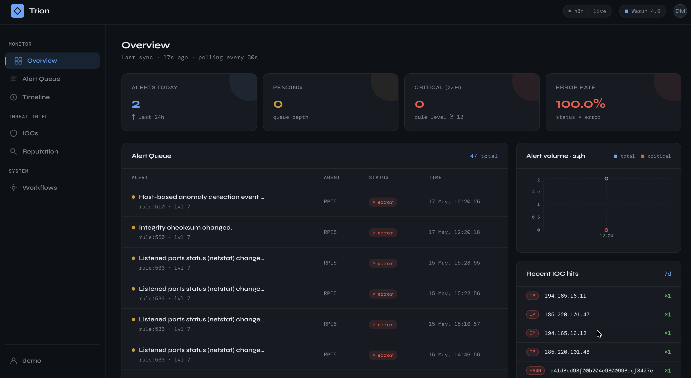
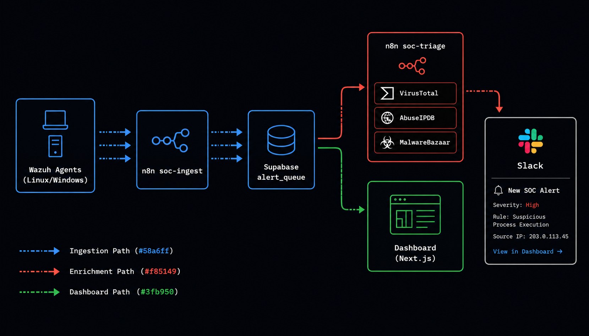
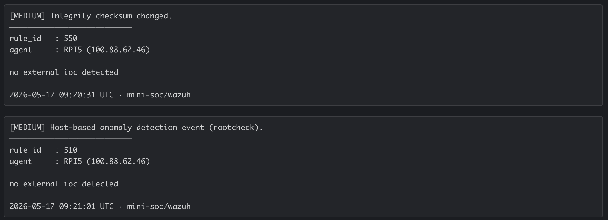

<p align="center">
  
</p>

# Trion

**Triage at the speed of threat.** — A self-hosted SOC automation platform for real-time Wazuh alert triage, automated IOC enrichment via VirusTotal / AbuseIPDB / MalwareBazaar, and instant Slack notifications.

<p align="left">
  
  
  
  
  
  
  
  
</p>

---

## Live Demo

👉 **[mini-soc.vercel.app](https://mini-soc.vercel.app)**

| Field    | Value       |
|----------|-------------|
| Password | `demo1234`  |

> Demo data only — no real alerts. Refreshes every 30 seconds.

<p align="center">
  
</p>

---

## What it does

mini-soc connects Wazuh agents running on your endpoints to a live dashboard and an automated triage pipeline:

1. **Wazuh agents** detect security events (brute-force, privilege escalation, file integrity changes, etc.) on any monitored machine
2. **soc-ingest** (n8n) receives the webhook, validates and normalises the alert, then inserts it into Supabase with deduplication
3. **soc-triage** (n8n) picks up pending alerts every 30 seconds, enriches IOCs (IPs, hashes, domains) against three threat intel APIs, and posts a formatted alert to Discord or Slack
4. **The dashboard** polls `/api/stats` every 30 seconds and displays everything live

---

## Features

- **Real-time KPIs** — alerts today, queue depth, critical count, 24h error rate
- **24h trend chart** — hourly breakdown with critical alert overlay (Recharts area chart)
- **Top Wazuh rules** — most-triggered rules over 7 days (bar chart)
- **Malicious IOC leaderboard** — top IPs, hashes, and domains flagged MALICIOUS in the last 7 days
- **Alert table** — paginated (10/page), click any row to inspect the raw Wazuh JSON in a modal
- **n8n workflow health** — live status of `soc-ingest`, `soc-triage`, `soc-error-handler`
- **JWT authentication** — single-password access, httpOnly cookie, middleware-protected routes
- **Auto-refresh** — 30-second client-side polling, no WebSocket complexity

---

## Architecture

<p align="center">
  
</p>

---

## Tech stack

| Layer | Technology |
|---|---|
| **Frontend** | Next.js 14, React 18, TypeScript, Tailwind CSS, Recharts |
| **Backend** | Next.js API Routes (Node.js), Jose (JWT HS256) |
| **Database** | Supabase (PostgreSQL) — table + 4 RPC functions |
| **Automation** | n8n (self-hosted) — 3 workflows |
| **Security data** | Wazuh 4.9 — XDR/SIEM agent + manager |
| **Threat intel** | VirusTotal API, AbuseIPDB API, MalwareBazaar API |
| **Notifications** | Discord Webhook, Slack |
| **Deployment** | Docker, Docker Compose, Vercel |

---

## Quick start

```bash
git clone https://github.com/S2K7x/Trion.git
cd Trion
./install.sh
```

The interactive script handles prerequisites, environment configuration, Supabase schema setup, and service launch — no manual steps required.

**Non-interactive flags:**

```bash
./install.sh --mode dev          # Next.js dev server + n8n in Docker
./install.sh --mode full         # Everything in Docker Compose
./install.sh --mode full --skip-db   # Skip schema if already applied
```

| Mode | Dashboard | n8n | Database |
|---|---|---|---|
| `dev` | `npm run dev` | Docker | Supabase cloud |
| `prod` | `npm start` | Docker | Supabase cloud |
| `docker` | Docker | Docker | Supabase cloud |
| `full` | Docker Compose | Docker Compose | Supabase cloud |
| `wazuh` | Docker Compose | Docker Compose | Supabase cloud + Wazuh |

---

## Environment variables

```bash
cp .env.example .env.local
```

| Variable | Description |
|---|---|
| `NEXT_PUBLIC_SUPABASE_URL` | Supabase project URL |
| `NEXT_PUBLIC_SUPABASE_ANON_KEY` | Supabase anon key (public) |
| `SUPABASE_SERVICE_KEY` | Supabase service_role key (**server-side only**) |
| `DASHBOARD_PASSWORD` | Dashboard login password |
| `DASHBOARD_SECRET` | JWT signing secret — min 32 chars (`openssl rand -hex 32`) |
| `N8N_API_URL` | n8n instance URL (`http://localhost:5678`) |
| `N8N_API_KEY` | n8n API key (Settings → API) |

---

## Supabase setup

Run [`supabase/migrations/001_init.sql`](supabase/migrations/001_init.sql) in the Supabase SQL Editor once. It creates the `alert_queue` table and all four RPC functions used by the dashboard.

**Table schema:**

| Column | Type | Description |
|---|---|---|
| `id` | bigint PK | Auto-increment |
| `dedup_key` | text unique | SHA-1 fingerprint — prevents duplicate ingestion |
| `raw_alert` | jsonb | Full original Wazuh alert |
| `rule_id` / `rule_level` / `rule_desc` | text / int / text | Wazuh rule metadata |
| `agent_name` / `agent_ip` | text | Source endpoint |
| `iocs` | jsonb | Extracted IOCs: `[{value, type, verdict}]` |
| `status` | text | `pending` → `processing` → `done` \| `error` |

**RPC functions:**

| Function | Returns |
|---|---|
| `get_error_rate()` | Error % over last 24h |
| `get_dashboard_trend()` | Hourly counts (total + critical) over 24h |
| `get_top_rules()` | Top 10 rules by occurrence over 7 days |
| `get_top_iocs()` | Top 20 MALICIOUS IOCs over 7 days |

---

## n8n workflows

Import the three workflows from [`n8n_workflows/`](n8n_workflows/) into your n8n instance (Settings → Import).

### soc-ingest

Triggered by Wazuh webhook. Validates the payload, extracts IOCs (IPs, hashes, domains) from alert fields, deduplicates, and inserts into Supabase.

```
Webhook ← POST /webhook/wazuh-ingest
  → Validate payload
  → Extract IOCs (srcip, dstip, url, sha256, md5)
  → Filter private/loopback ranges (RFC 1918, ::1)
  → Build SHA-1 dedup key
  → Supabase INSERT (conflict on dedup_key → ignore)
  → Respond 200
```

### soc-triage

Runs every 30 seconds. Picks up pending alerts, enriches each IOC against three threat intel APIs, posts a formatted alert card to Slack.

<p align="center">
  
</p>

```
Schedule (30s)
  → Reset stuck jobs (processing > 5 min → pending)
  → Fetch pending alerts
  → Check queue (cap 5/cycle, detect saturation > 50)
  → SplitInBatches: one alert at a time
      → Init context (loop-break guard: reject non-pending, error bubbles)
      → Mark processing
      → IF Has IOCs?
          ├─ No  → Format message → Discord → Mark done
          └─ Yes → SplitInBatches: one IOC at a time
                     → Rate-limit guard (15s between VT calls)
                     → IP   → VirusTotal + AbuseIPDB   → verdict
                     → Hash → VirusTotal + MalwareBazaar → verdict
                     → Domain → VirusTotal              → verdict
                 → Format Slack message (all verdicts)
                 → Slack → Mark done
```

Possible verdicts: `CLEAN` · `SUSPICIOUS` · `MALICIOUS` · `UNKNOWN` (API unavailable)

### soc-error-handler

Retries alerts stuck in `error` status by re-queuing them as `pending`.

---

## Wazuh integration

### Setup on the Manager

```bash
cp wazuh/custom-n8n /var/ossec/integrations/custom-n8n
chmod 750 /var/ossec/integrations/custom-n8n
chown root:wazuh /var/ossec/integrations/custom-n8n
pip3 install requests
```

Add to `/var/ossec/etc/ossec.conf` (see [`wazuh/ossec-integration.conf`](wazuh/ossec-integration.conf)):

```xml
<integration>
  <name>custom-n8n</name>
  <hook_url>http://N8N_HOST:5678/webhook/wazuh-ingest</hook_url>
  <level>7</level>
  <alert_format>json</alert_format>
</integration>
```

```bash
systemctl restart wazuh-manager
tail -f /var/ossec/logs/integrations.log
```

**Severity levels:** ≥ 7 captures MEDIUM+ events. Use ≥ 10 for a quieter initial deployment.

### IOC extraction

| Wazuh field | IOC type |
|---|---|
| `data.srcip` / `data.dstip` | IP address |
| `data.url` | Domain / URL |
| `syscheck.sha256_after` | SHA-256 file hash |
| `syscheck.md5_after` | MD5 file hash |

Private and loopback ranges are automatically filtered before enrichment.

---

## Deploy on Vercel

1. Push to GitHub
2. Import on [vercel.com](https://vercel.com) — Next.js auto-detected
3. Add the 7 environment variables
4. Deploy

> If your n8n instance is not publicly reachable, workflow status cards show "unreachable" — the rest of the dashboard works normally.

---

## Project structure

```
app/
  api/
    auth/route.ts          # Login → JWT cookie (24h, HS256)
    logout/route.ts        # Clear session cookie
    stats/route.ts         # GET /api/stats — 9 parallel Supabase queries
  login/page.tsx           # Login page
  page.tsx                 # Dashboard — SSR, force-dynamic
  layout.tsx               # Root layout — JetBrains Mono, dark theme
components/
  DashboardShell.tsx       # Client wrapper — 30s polling, state management
  StatCounters.tsx         # KPI cards
  TrendChart.tsx           # 24h area chart (Recharts)
  TopRulesChart.tsx        # 7-day bar chart (Recharts)
  AlertsTable.tsx          # Paginated table + JSON detail modal
  TopIocsTable.tsx         # MALICIOUS IOC leaderboard
  WorkflowCards.tsx        # n8n workflow status cards
lib/
  supabase-server.ts       # Supabase client (service key, server-only)
  queries.ts               # getDashboardStats() — 9 parallel queries
  types.ts                 # TypeScript interfaces
middleware.ts              # JWT guard — all routes except /login
n8n_workflows/
  soc-ingest.json          # Wazuh ingestion workflow
  soc-triage.json          # IOC enrichment + notification workflow
  soc-error-handler.json   # Error retry workflow
wazuh/
  custom-n8n               # Python integration script (Wazuh Manager)
  ossec-integration.conf   # ossec.conf snippet
  n8n-transform.js         # Code node — alert field normalisation
supabase/
  migrations/001_init.sql  # Full schema: table + 4 RPC functions
```

---

## Security notes

- `SUPABASE_SERVICE_KEY` is never exposed to the client — server-side API routes only
- All routes are protected by JWT middleware; unauthenticated requests redirect to `/login`
- Session cookie is `httpOnly`, `sameSite: lax`, 24h TTL
- The Wazuh webhook endpoint should be firewalled to the Manager IP in production
- No credentials are hardcoded anywhere — all secrets are environment variables
