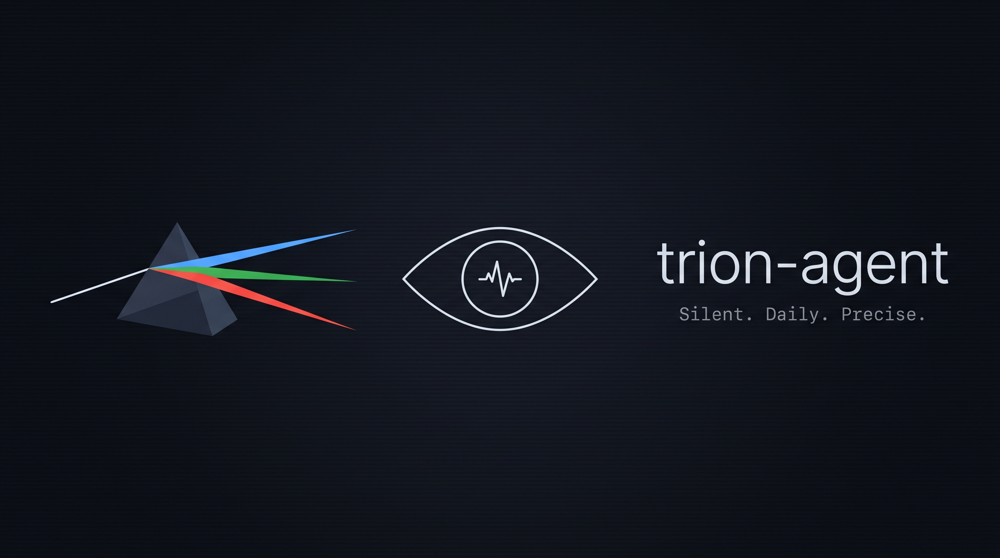

&nbsp;


&nbsp;

# trion-agent
> Silent. Daily. Precise.

Part of the [Trion](https://github.com/S2K7x/Trion) SOC platform.

---

## What it does

trion-agent takes a daily snapshot of critical system state (open ports, running services, users, cron jobs, autoruns), diffs it against the previous day's baseline, and sends the delta to a local or cloud LLM that classifies each change as BENIGN, SUSPECT, or CRITICAL. Only actionable findings trigger a Slack notification — BENIGN runs are completely silent.

A self-hosted web dashboard (`agent_ui.py`) lets you browse scan history, compare diffs, configure the agent, and trigger manual runs from a browser — no command line needed after setup.

---

## Architecture

```
agent.py → collector → differ → llm → notifier → Slack
                ↓
            data/baseline.json
            data/snapshots/
            data/last_run.json
                ↓
          agent_ui.py → web dashboard (port 8080)
```

- Baseline stored locally as `data/baseline.json` — never deleted, permanent audit trail
- Dated snapshots archived in `data/snapshots/` for forensic review
- LLM receives only the diffs, never full file contents
- Provider-agnostic: Ollama (local), OpenAI, Anthropic

---

## Modules

| Module | Default | Description |
|--------|---------|-------------|
| `config-drift` | enabled | Monitors open ports, running services, users, cron, autoruns |
| `threat-detection` | disabled | Monitors login history, failed auth, SUID files, suspicious processes |

---

## Requirements

- Python 3.11+
- pip
- A LLM provider: Ollama (local, no API key) or an OpenAI / Anthropic API key

---

## Installation

### Native (Linux / macOS / Windows)

**Linux / macOS**
```bash
git clone https://github.com/S2K7x/Trion
cd Trion/trion-agent
./install.sh
```

**Windows**
```powershell
git clone https://github.com/S2K7x/Trion
cd Trion/trion-agent
./install.ps1
```

The install script:
1. Installs Python dependencies
2. Copies `config.toml.example` → `config.toml` (permissions set to 600 automatically)
3. Registers a daily 07:00 run via systemd timer (Linux), LaunchAgent (macOS), or Scheduled Task (Windows)

### Docker

The agent stack runs two containers that share a local `data/` volume:

| Container | Role | Description |
|-----------|------|-------------|
| `trion-agent-dashboard` | Web UI | FastAPI dashboard on port 8080 |
| `trion-agent-scanner` | Scheduler | Runs daily scans and writes results to `data/` |

```bash
cd trion-agent
cp config.toml.example config.toml   # edit LLM, notifications, schedule
docker compose up -d --build
```

The dashboard is available at `http://localhost:8080`. The scanner starts immediately and will run at the time configured in `config.toml` under `[agent] schedule`.

To stop:
```bash
docker compose down
```

To view logs:
```bash
docker compose logs -f dashboard    # web UI logs
docker compose logs -f agent        # scanner logs
```

> **Note:** `config.toml` is mounted read-only into both containers. Edit it on the host and restart to apply changes. The `data/` directory is a bind-mount — scan results persist on the host between container restarts.

---

## Configuration

Edit `config.toml` before the first run. Required fields:

- `notifications.slack_webhook` — Slack Incoming Webhook URL
- `llm.provider` — `ollama` | `openai` | `anthropic`
- `llm.api_key` — required if provider is not `ollama`
- `llm.model` — depends on the provider

| Provider | Model example | api_key required |
|----------|--------------|-----------------|
| `ollama` | `llama3.2` | No |
| `openai` | `gpt-4o-mini` | Yes |
| `anthropic` | `claude-haiku-4-5` | Yes |

See `config.toml.example` for all available options including module settings, retention, and dashboard auth.

---

## Web Dashboard

The dashboard (`agent_ui.py`) is a FastAPI app that reads the same `data/` files as the scanner. It runs independently of the scanner and can be started without a baseline in place.

**Routes:**

| Route | Description |
|-------|-------------|
| `/` | Overview — last run verdict, module status, 7-day history strip |
| `/history` | Full scan history by date |
| `/history/{date}/{module}` | Line-by-line diff for a specific scan |
| `/settings` | Configure agent, LLM, notifications, modules |
| `/api/run` | `POST` — trigger an immediate scan |
| `/api/status` | `GET` — last run JSON |
| `/api/logs/stream` | `GET` — server-sent events log tail |

**Auth:** single password set in `config.toml` under `[ui] password`. JWT session cookie, 24h lifetime.

To start the dashboard standalone (without the scheduler):
```bash
python3 agent_ui.py
# → http://localhost:8080
```

---

## CLI usage

```bash
python3 agent.py --run-now    # run immediately and exit
python3 agent.py --dry-run    # show diffs, no LLM/Slack/baseline update
python3 agent.py --status     # show agent state
python3 agent.py --debug      # verbose logging
python3 agent.py              # enter scheduler loop (runs at config schedule time)
```

---

## Slack notifications

**CRITICAL**
```
🔴 *CRITICAL* — hostname
Module: config-drift | 2026-05-19

• new LISTEN port 4444 — unexpected service binding on non-standard port
• /etc/passwd modified — new entry added outside package manager

Confidence: 92% | @channel
```

**SUSPECT**
```
🟡 *SUSPECT* — hostname
Module: config-drift | 2026-05-19

• new cron entry for root — unusual schedule, warrants review

Confidence: 65%
```

BENIGN verdicts produce no notification.

---

## Adding custom commands

Override the built-in command list per module in `config.toml`:

```toml
[modules.config-drift]
enabled = true
commands = [
  "ls -la /opt/",
  "cat /etc/hosts",
]
```

When `commands` is set, the built-in list is replaced entirely. Commands containing `;` `&` `|` `` ` `` `$` `(` `)` `{` `}` are rejected at runtime for security.

---

## Security notes

- `config.toml` permissions: `600` (set automatically by `install.sh`; mounted read-only in Docker)
- `data/` permissions: `700` (set automatically)
- The LLM receives only diffs, never full file contents
- Baseline is never deleted — overwritten only, preserving audit trail
- Shell injection protection applied to all user-defined commands

---

## Standalone vs Trion SOC

trion-agent runs fully standalone — no Wazuh, no n8n, no Trion SOC dashboard required. It reads its config from `config.toml` and sends alerts directly to Slack. The agent dashboard (port 8080) is also completely independent of the SOC dashboard (port 3000).
